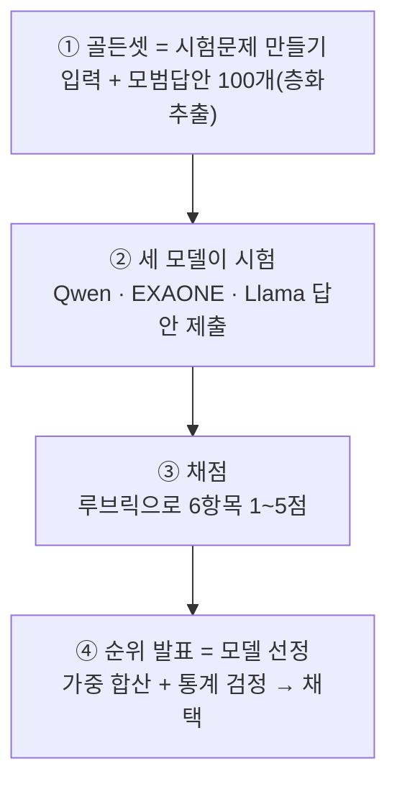
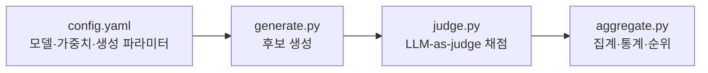

# 암묵지 추출용 LLM 모델 비교·선정 계획서 (v2)

> 영상 기반 암묵지 후보 생성 파이프라인에서 사용할 LLM을 선정하기 위한 비교 실험 계획.
> 대상: 사내 온프레미스 환경 / 후보 모델 3종 / 한·영 혼용 발화 처리.
> v2 변경점: 골든셋 규모 확대(100개·층화추출), 점수 계산식 명시, Judge 후보 명시, 프롬프트 통제 구체화, 통계 검정 추가, 양자화 조건 통일.

---

## 1. 배경 및 목적

전체 파이프라인(데이터 수집 → 전처리 → YOLO 객체탐지 → **암묵지 후보 생성** → 품질 검증 → 지식 DB화 → RAG 활용) 중 **4단계 "암묵지 후보 생성"** 에 투입할 LLM을 선정한다.

이 LLM의 역할은 다음과 같다.

- 입력: VLM 결과(행동/상황 이해) + 정제된 Transcript(발화)
- 처리: 두 신호를 융합해 단순 요약이 아닌 **현장 노하우(암묵지)를 추론**
- 출력: 근거·신뢰도·관련 작업단계가 포함된 구조화(JSON) 후보 N개

따라서 일반 벤치마크 순위가 아니라, **이 역할에 가장 적합한 모델**을 자체 실험으로 선정하는 것이 목적이다.

### 과제의 특수성

- **한·영 코드스위칭**: 현장 발화는 "이 valve를 lockout 하고 pressure 확인하고…" 식으로 한국어에 영어 기술용어가 섞인다. 모델은 이를 분리하지 않고 **혼용 상태 그대로 의미를 이해**해야 한다.
- **환각 위험**: 입력에 없는 노하우를 지어내면 후속 검증 단계를 통과해 지식 DB를 오염시킬 수 있어, 충실도(환각 억제)가 가장 중요한 기준이다.
- **도메인 특수성**: 어떤 모델도 제철 현장 용어의 구체적 의미까지는 학습하지 못했으므로, 프롬프트에 **도메인 용어집(glossary)** 을 주입해 보완한다.
- **정답의 다양성(reference-free)**: 암묵지 후보는 정답이 하나가 아니라 타당한 표현이 여럿일 수 있다. 따라서 채점은 골든셋과의 문자열 일치가 아니라 **근거·타당성 기준**으로 한다(3.5절 참조).

---

## 2. 비교 대상 모델 (온프레미스)

사내 데이터 보안상 외부 API를 사용할 수 없어, 온프레미스 구동이 가능한 오픈소스 모델로 한정한다.

| 모델 | 규모 | 선정 이유 |
|---|---|---|
| Qwen2.5-72B-Instruct | 72B | 다국어(한·영·중) 강세 → 코드스위칭에 유리, 구조화 출력 안정적 |
| EXAONE 3.5 32B (LG) | 32B | 한국어 특화 → 자연스러움·국내 도메인 톤 강점 |
| Llama 3.3 70B-Instruct | 70B | 영어 추론·지시 따르기 강세 → 영어 기술용어 이해 우수 |

### 2.1 양자화 조건 통일 (공정 비교)

모델 규모(72B/32B)와 양자화 수준이 뒤섞이면 성능 차이의 원인을 분리할 수 없다(교란요인). 이를 방지하기 위해 **세 모델 모두 동일하게 4bit 양자화(AWQ 또는 GPTQ)** 로 통일하여 구동한다. 따라서 본 실험의 결과는 "양자화 동일 조건에서의 모델 간 성능 차이"로 해석된다.

> 서빙은 vLLM(OpenAI 호환 API)을 사용한다.

---

## 3. 평가 방법론

### 3.1 전체 흐름

핵심 개념은 **"세 모델에게 동일한 시험을 보게 하고 채점하여 최적 모델을 선정"** 하는 것이다.



### 3.2 골든셋 구성 (합성 + 전문가 검수, 100개·층화추출)

평가 기준이 될 "이상적인 암묵지 후보"를 포함한 샘플 세트를 구성한다. 통계적으로 의미 있는 비교를 위해 **최소 100개**를 목표로 한다(20~30개는 모델 간 근소한 점수 차를 가르기에 표본이 부족).

- **규모**: 100개. 시나리오 유형별 **층화추출(stratified sampling)** 로 구성하여 특정 유형에 치우치지 않게 한다.
  - 예시 층(strata): 한·영 혼용 정도(고/중/저), 작업 유형(점검/조작/이상대응 등), 발화 길이(단문/장문).
- **1차(합성)**: 제철 현장 시나리오 기반으로 VLM 결과 + Transcript + 이상적 후보를 합성 생성.
- **2차(검수)**: 현장 전문가가 합성 골든셋을 검수·수정(human-in-the-loop). 0에서 작성하는 것보다 부담이 크게 줄며 도메인 타당성을 확보.

> 합성으로 시작하되 **최종 선정 직전에는 사람 검수를 반드시 거친다.**

### 3.3 평가 항목 및 가중치

항목별로 "틀렸을 때의 손해 크기"를 반영해 가중치를 차등 부여한다.

| 평가 항목 | 기호 | 가중치 | 설명 |
|---|---|---|---|
| 충실도 (환각 억제) | Faithfulness | 0.25 | 입력에 근거 없는 내용을 생성하지 않는가 |
| 정확성 | Accuracy | 0.20 | 절차·인과·용어가 정확한가 |
| 유용성 | Usefulness | 0.20 | 진짜 현장 노하우인가, 당연한 내용인가 |
| 한·영 혼용 이해도 | CodeSwitch | 0.15 | 코드스위칭 발화의 기술 의미를 이해하는가 |
| 한국어 자연스러움 | Fluency | 0.10 | 후처리 없이 쓸 만한가 |
| 형식 준수 | Format | 0.10 | 지정 스키마·개수를 지키는가 |

각 항목은 1~5점, 1·3·5점의 기준을 사전 정의한 루브릭으로 채점한다.

### 3.4 최종 점수 계산식

각 샘플에 대한 모델의 최종 점수는 항목별 점수의 가중합으로 정의한다.

```
Final Score = 0.25 × Faithfulness
            + 0.20 × Accuracy
            + 0.20 × Usefulness
            + 0.15 × CodeSwitch
            + 0.10 × Fluency
            + 0.10 × Format
```

- 각 항목 점수는 1~5점이며, 가중치 합이 1이므로 Final Score 역시 1~5점 척도다.
- 모델별 최종 성능은 **100개 샘플의 Final Score 평균**으로 보고한다.

### 3.5 채점 방식

- **참조 기반의 한계(reference-free 보정)**: 암묵지는 정답이 여럿일 수 있으므로, 골든셋과 표현이 달라도 입력에 근거가 있고 타당하면 감점하지 않는다. 루브릭은 "정답 일치"가 아니라 "근거·타당성"을 채점하는 reference-free 성격으로 운영한다.
- **1차 자동 채점(LLM-as-judge)**: 후보와 다른 계열의 심판 모델로 6항목을 자동 채점한다.
  - **심판 후보(온프레미스 가능)**: DeepSeek-R1, Qwen2.5-72B(후보와 별도 인스턴스·다른 역할), Mistral-Large 급 중 택일.
  - (외부 API 반출이 허용될 경우에 한해 GPT-5.5, Claude 등 상용 모델도 심판 후보로 검토 가능.)
  - **편향 완화**: 제시 순서 무작위화(position bias 완화)를 적용하고, 여건이 되면 다중 심판 앙상블로 확장한다.
- **2차 사람 검수**: 전체 중 일부 샘플을 사람이 직접 검수해 자동 채점의 신뢰도를 보정한다. 검수자가 2인 이상일 경우 **채점자 간 일치도(Cohen's κ 또는 Krippendorff's α)** 를 함께 보고한다.
- **형식 준수**는 JSON 파싱 성공률로 자동 집계한다.

### 3.6 통계 분석

단순 점수 비교(예: 92점 vs 91점)만으로는 차이의 실재 여부를 알 수 없으므로 다음을 함께 산출한다.

- 모델별 **항목별 평균 및 표준편차**, 그리고 **가중 종합 점수의 평균·표준편차**.
- 모델 쌍 간 **paired t-test**(동일 샘플에 대한 점수이므로 대응표본). 유의수준 p < 0.05 기준으로 차이의 유의성을 판단.
- 점수 차가 통계적으로 유의하지 않을 경우, **표준편차와 운영 비용(VRAM, 추론 속도)** 을 추가로 고려하여 최종 모델을 선정한다.

---

## 4. 실험 통제 (재현성·공정성)

모든 모델에 대해 다음을 **완전히 동일**하게 고정한다. 이것이 비교 공정성의 핵심이다.

| 통제 항목 | 내용 |
|---|---|
| System Prompt | 전 모델 동일 |
| User Prompt | 전 모델 동일 |
| Glossary(용어집) | 전 모델 동일하게 주입 |
| Output Schema(JSON) | 전 모델 동일 |
| temperature | 동일 값으로 고정 |
| seed | 동일 값으로 고정 |
| 양자화 | 4bit 통일(2.1절) |

> 단일 프롬프트 고정은 공정성을 확보하지만 각 모델의 천장(ceiling) 성능을 보지 못한다. 본 실험은 "공정 비교" 트랙으로 진행하며, 모델별 최적 프롬프트를 적용한 "실전 성능" 비교는 **확장 실험(향후 과제)** 으로 둔다.

---

## 5. 구현 계획 (코드 구조)



| 파일 | 역할 |
|---|---|
| `config.yaml` | 모델 엔드포인트, 가중치, 샘플 수, temperature·seed, 프롬프트·스키마 경로 정의 |
| `generate.py` | 골든셋을 세 모델에 동일 조건으로 입력 → 후보 생성·저장 |
| `judge.py` | 심판 모델로 6항목 자동 채점(제시 순서 무작위화) → 점수 저장 |
| `aggregate.py` | 가중 합산·평균/표준편차·paired t-test·순위·시각화 출력 |

---

## 6. 의사결정 기준

- 가중 종합점수 1등 모델을 기본 채택한다.
- **단, paired t-test로 1·2위 간 차이가 유의하지 않으면** 표준편차·VRAM·추론 속도 등 운영 조건으로 최종 결정한다.
- 충실도 점수가 유독 낮은 모델은 순위와 무관하게 후보에서 제외 검토(지식 DB 오염 위험).

> 평가 결과는 항목별 평균 점수와 가중 종합 점수를 함께 제시한다. 모델 간 점수 차이가 근소할 경우 표준편차와 운영 비용(VRAM, 추론 속도)을 추가로 고려하여 최종 모델을 선정한다.

---

## 7. 한계 및 유의점

- 합성 골든셋은 self-preference 편향 가능성이 있어 **전문가 검수**로 보완한다.
- LLM-as-judge는 1차 필터이며 **일부 샘플의 사람 검수**를 병행하고, 가능 시 다중 심판·순서 무작위화로 편향을 완화한다.
- 암묵지는 정답이 여럿일 수 있어, 루브릭을 **reference-free(근거·타당성 기준)** 로 운영한다.
- 단일 프롬프트 고정은 공정 비교를 보장하나 모델별 천장 성능은 반영하지 못한다(확장 실험으로 분리).
- 공개 리더보드(LMArena, LiveBench 등)는 **후보를 추리는 참고용**으로만 사용하고, 최종 선정은 본 골든셋 기반 실험으로 결정한다.

---

## 부록. 산출물

- 채점 스코어 시트(Excel): 점수 입력 시 가중 반영 순위 자동 산출
- 골든셋 템플릿(층화추출 100개) / 채점 루브릭 / LLM-as-judge 프롬프트
- 비교 실험 코드: `config.yaml` · `generate.py` · `judge.py` · `aggregate.py`