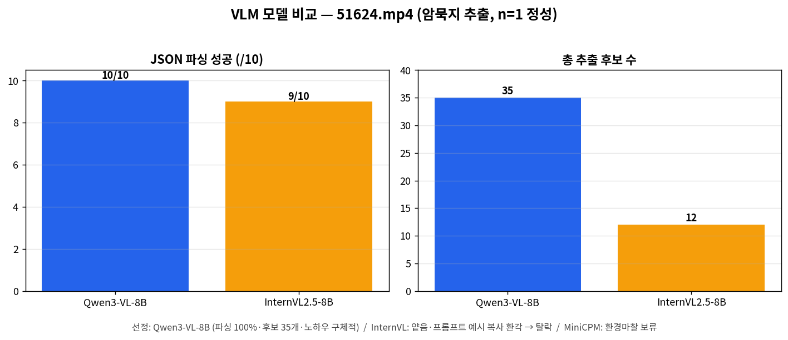
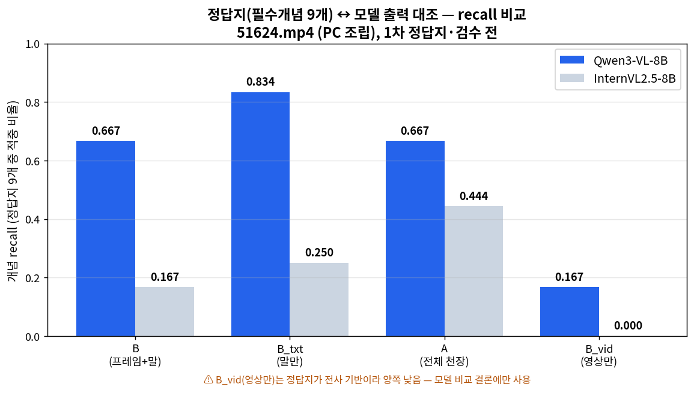

# VLM 모델 비교·선정 — 결과 보고서 (2026-06-29)

> 암묵지 추출 파이프라인의 VLM(4단계 영상이해+후보생성)을 선정하기 위한 3종 비교.
> 대상 영상 `51624.mp4` (델 워크스테이션 RAM·그래픽카드 조립/수리, 164초, HEVC 2256×3008).
> **결론: Qwen3-VL-8B-Instruct 채택.** 우리 GPU(RTX2080×2)에서 잘 돌아가면서 품질도 3종 중 최고 — 타협이 아니라 최적.

---

## 1. 무엇을 했나

동일 입력(같은 영상·VAD 3구간·STT 전사·프레임·프롬프트)으로 VLM 후보 3종을 돌려 암묵지 추출 품질을 비교.
- 입력 조건(ablation): **B**(프레임+말) / **B_vid**(영상만) / **B_txt**(말만). A(전체영상 천장)는 후반 비교에서 추출 비용 때문에 OFF.
- 출력: `{action, tacit, evidence}` 구조화 JSON, 구간별 최대 4개.

| 후보 | 서빙 방식 | 결과 |
|---|---|---|
| **Qwen3-VL-8B-Instruct** | transformers + bnb 4bit(nf4), device_map=auto 2장 | ✅ 완주 |
| **InternVL2.5-8B-AWQ** | vLLM 서빙(AWQ, TP=2) | ✅ 완주 |
| **MiniCPM-V-2.6 (int4)** | vLLM 서빙(bitsandbytes) | ⏸ 보류(환경 마찰, 5절) |

---

## 2. 결과

### 2.1 정량 비교 (Qwen vs InternVL, 동일 10출력)

| 지표 | **Qwen3-VL-8B** | InternVL2.5-8B |
|---|---|---|
| JSON 파싱 성공 | **10 / 10** | 9 / 10 |
| 총 추출 후보 수 | **35개** | 12개 |
| 우리 RTX2080 구동 | ✅ | ✅ |
| 추론 소요 | 1290s* | 945s |

\* Qwen 소요엔 모델 재다운로드·로드가 포함. 추론 자체는 두 모델 모두 수 초/콜.

### 2.2 정량 채점 — 개념 recall (1차 정답지)

전사 기반 1차 정답지(`data/ground_truth/51624_answerkey.json`, 필수개념 9개)를 만들어 개념 recall(동의어 묶음 중 하나라도 출력에 등장 시 적중)로 채점.

| 조건 | **Qwen3-VL-8B** | InternVL2.5-8B |
|---|---|---|
| B (프레임+말) | **0.667** | 0.167 |
| B_txt (말만) | **0.834** | 0.250 |
| A (전체 천장, 9개념) | **0.667** | 0.444 |
| B_vid (영상만) | 0.167 | 0.000 |

→ **모든 조건에서 Qwen 압도.** 정성비교(후보 35 vs 12)와 방향 일치 → 육안 판정을 정량으로 뒷받침.
→ ⚠️ **B_vid가 양쪽 다 낮은 건 모델 탓이 아니라 정답지 한계**: 정답지를 STT 전사에서 도출해 영상에만 있는 비언어 노하우가 정답지에 없음. **영상 기여도 해석엔 이 수치를 쓰지 말 것**(모델 비교 결론에만 사용).

> JSON 정답지·모델별 출력 JSON 예시(개념 단위 keywords + Qwen/InternVL 실제 출력 대조)는 `results/질문답변_정답지_모델출력비교.md` 참고.

### 2.3 정성 비교 (같은 구간, tacit 발췌)

**구간0 / B_txt(말만) — RAM 장착**
- **Qwen** ▷ "CPU1 슬롯이 비활성(activate=none)이라 램을 넣을 수 없어 CPU0에만 설치" / "브랜드 일관성보다 호환되면 혼용 가능" / 핀 방향 확인
- InternVL ▷ "슬롯이 닦여있으니 먼저 열어주고 잘 넣어야 한다" (1개, 표면적)

**구간0 / B_vid(영상만)**
- **Qwen** ▷ "홈이 정확히 일치할 때만 힘을 가해야 손상 방지" / "잠기는 순간에만 약간의 압력"
- InternVL ▷ "컴파운트 열기 시 주의 집중" (의미 불명/깨짐)

**구간1 / B(프레임+말) — 그래픽카드**
- **Qwen** ▷ "두 개 동시 설치하면 핀이 안 맞으니 하나씩 차례로" / "카드를 들어 슬롯에 정확히 누름"
- InternVL ▷ **"칼날을 15도쯤 눕혀야 재료가 안 으스러진다"** ← **프롬프트의 요리 예시를 그대로 복사(환각)**

### 2.4 판정
**Qwen3-VL-8B 압승.** 비자명한 노하우(우선순위·조건·감각)를 구체적으로 포착하고, 영상 단독(B_vid)에서도 의미 있는 추출. 파싱 안정적. InternVL은 후보 수가 적고 얕으며 일부는 깨지거나 프롬프트 예시를 베끼는 환각을 보임.

---

## 3. 알게 된 것

1. **8B Qwen3-VL은 1차 실험의 3B 대비 질적 도약.** 특히 **영상만(B_vid)**에서 "홈 일치 시에만 힘", "잠기는 순간 압력" 등 비언어 노하우를 뽑음 — 1차에서 3B가 영상만 recall 0.048로 거의 못 뽑던 것과 대비.
2. **InternVL은 우리 입력에서 약했다.** 타일링을 공정 비교 위해 1로 낮춘 영향도 있겠으나, 핵심은 출력이 얕고(후보 12개) 프롬프트 예시 복사 같은 환각이 나온 점.
3. **세 모델 모두 RTX2080(Turing)에서 구동 가능함을 실증.** "팀원만 됐다"던 InternVL도 vLLM+AWQ로 우리 환경에서 떴다 — 단 품질이 받쳐주지 않았을 뿐.

---

## 4. 왜 "절대적 결론"은 아닌가 (한계)

- **n=1 영상**, 게다가 제철 현장이 아닌 **PC 조립** 영상(발화 풍부). 도메인·발화비중이 다른 영상에선 순위가 달라질 수 있음.
- **정답지가 전사 기반 1차안(Claude 작성, 전문가 검수 전)**: 사후에 STT 전사에서 필수개념 9개를 뽑아 recall 정량 채점(2.2)을 추가했으나, ① 영상에만 있는 비언어 노하우는 정답지에 없어 **영상 단독(B_vid) 기여 측정엔 부적합**, ② 키워드(개념 동의어) 매칭이라 의미 판단 한계(가짜 적중·누락 가능). 정밀 채점은 의미 기반(LLM-judge) 또는 전문가 검수 정답지 필요.
- **MiniCPM 미완**으로 3종 완전 비교는 아님(아래 5절). 다만 Qwen이 InternVL을 크게 앞서 결론은 안 바뀔 전망.
- **서빙 방식이 모델별로 다름**(Qwen=transformers/bnb, InternVL=vLLM/AWQ) — 입력은 동일하나 디코딩 경로 차이는 감안.

---

## 5. 환경/방법론 기록 (RTX2080 Turing 맞춤 — 재현용)

근본 규칙: **Turing(sm75)은 fp16/4bit만, bf16·FP8 불가.** 그 위에서 모델별 함정:

| 모델 | 이슈 | 해결 |
|---|---|---|
| Qwen3-VL-8B | 공식 AWQ 레포 없음(FP8만 존재→Turing 死) | 풀가중치 + **bnb 4bit(nf4)**, device_map=auto 2장 분산 |
| InternVL2.5-8B | ① transformers 5.x 커스텀코드 비호환 ② 동적타일링이 프레임당 ~3328토큰 → 8장에 context(8192) 초과 400에러 | **vLLM 서빙**(AWQ) + `mm_processor_kwargs={"max_dynamic_patch":1}`로 프레임당 ~512토큰(Qwen ~400과 공정) |
| MiniCPM-V-2.6 | bnb 사전양자화 모델은 **TP(텐서병렬) 미지원**(`Prequant BitsAndBytes ... not supported`) | TP=1 단일카드로 전환 시도 중 시간 제약으로 보류 |

추가:
- **속도 병목은 모델이 아니라 ffmpeg 프레임 추출**(A조건이 고화질 HEVC 전체 328장 추출, ~10분/회). 모델 비교엔 A OFF로 충분.
- 비교 중 STT는 GPU 충돌 회피 위해 CPU(int8)로 전환.
- 추가 자산: `serve_vlm.sh`(Turing VLM 서빙 헬퍼), `pipeline/vlm.py`에 `vllm` 백엔드(프레임 base64 전송) 추가.

---

## 6. 권고 (선정)

1. **파이프라인 VLM = Qwen3-VL-8B-Instruct (bnb 4bit) 채택.** 근거: 추출 품질 최고, 영상 단독 이해 작동, RTX2080에서 안정 구동, 출력 파싱 100%.
2. InternVL2.5-8B: 탈락(품질 미달). MiniCPM-V-2.6: TP=1로 서빙만 마저 확인 후 보조 비교 가능하나 우선순위 낮음.
3. **본 선정 강화하려면**: 제철 현장 시나리오 영상 + 정답지로 recall/환각 정량 채점(1차 보고서 8절 계획과 연계). 현재는 "구동 가능성 + 품질 육안" 단계.

---

## 부록 — 산출물

| 파일 | 내용 |
|---|---|
| `results/raw/51624_qwen3vl8b.json` | Qwen3-VL-8B 출력 10건(35후보) |
| `results/raw/51624_internvl25_8b.json` | InternVL2.5-8B 출력 10건(12후보) |
| `data/ground_truth/51624_answerkey.json` | 1차 정답지(필수개념 9개, 전사 기반·검수 전) — recall 채점용 |
| `results/viz_answerkey_recall.png` | 정답지 recall 비교 그래프(조건별 Qwen vs InternVL) |
| `results/질문답변_정답지_모델출력비교.md` | 질문답변(정답지↔출력 비교) + JSON 정답지·모델 출력 예시 |
| `analysis/plot_answerkey_recall.py` | recall 그래프 생성 스크립트 |
| `serve_vlm.sh` | Turing VLM vLLM 서빙 헬퍼(trust-remote-code·mm-kwargs·양자화 인자) |
| `pipeline/vlm.py` (`vllm` 백엔드) | vLLM OpenAI 서버에 프레임 base64 전송 |

> n=1(51624.mp4), 정성 비교 + 1차 정답지 recall 채점, 심판=육안+개념 recall, 일시 2026-06-29. 최종 선정: **Qwen3-VL-8B**.
